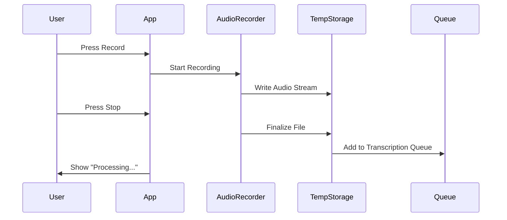
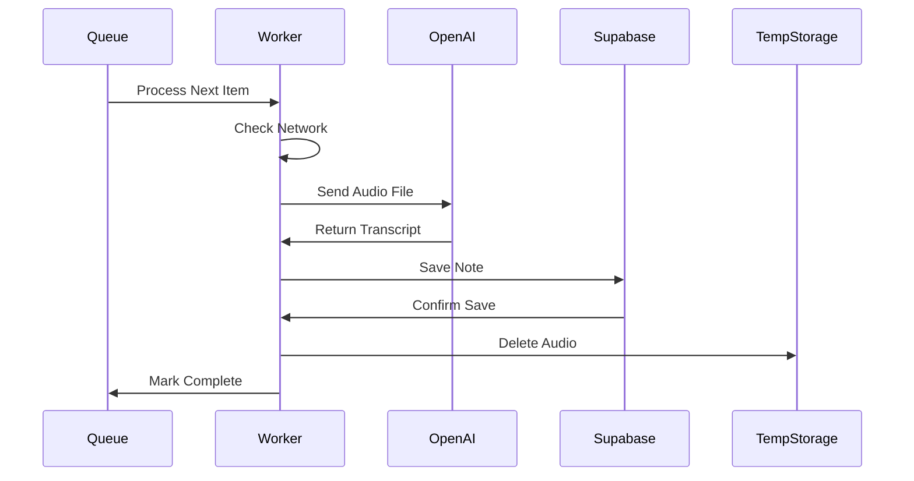
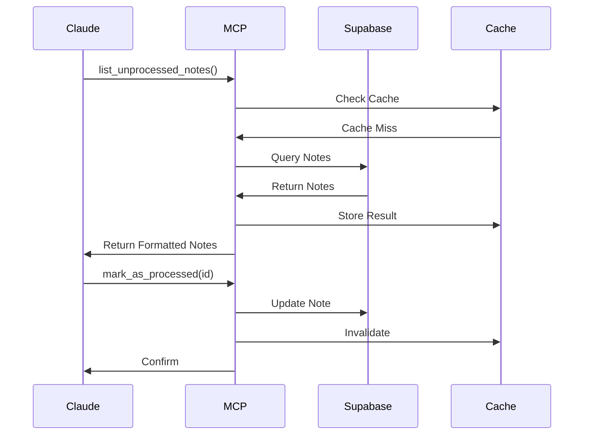

# Voice Notes MCP - Architecture Document

## System Architecture Overview

The Voice Notes MCP system follows a cloud-connected architecture with three primary components: an Android mobile application, a cloud database (Supabase), and an MCP server that interfaces with Claude Desktop. This architecture prioritizes simplicity, reliability, and seamless synchronization.

```
┌─────────────────┐     ┌─────────────────┐     ┌─────────────────┐
│   Android App   │────▶│    Supabase     │◀────│   MCP Server    │
│   (Kotlin)      │     │   (PostgreSQL)  │     │   (Python)      │
└─────────────────┘     └─────────────────┘     └─────────────────┘
                               ▲                          │
                               │                          │
                        ┌──────────────┐          ┌──────▼────────┐
                        │  OpenAI API  │          │ Claude Desktop │
                        │   (Whisper)  │          │     (MCP)      │
                        └──────────────┘          └───────────────┘
```

## Component Architecture

### 1. Android Application Architecture

The Android app follows Clean Architecture principles with MVVM pattern:

```
app/
├── presentation/          # UI Layer
│   ├── screens/
│   │   ├── MainScreen.kt
│   │   ├── RecordingScreen.kt
│   │   └── SettingsScreen.kt
│   ├── viewmodels/
│   │   ├── MainViewModel.kt
│   │   └── RecordingViewModel.kt
│   └── components/
│       ├── NoteCard.kt
│       ├── RecordButton.kt
│       └── SyncIndicator.kt
│
├── domain/               # Business Logic
│   ├── models/
│   │   └── Note.kt
│   ├── repositories/
│   │   └── NotesRepository.kt
│   └── usecases/
│       ├── RecordAudioUseCase.kt
│       ├── TranscribeAudioUseCase.kt
│       └── SyncNotesUseCase.kt
│
├── data/                # Data Layer
│   ├── local/
│   │   ├── AudioRecorder.kt
│   │   └── LocalCache.kt
│   ├── remote/
│   │   ├── SupabaseClient.kt
│   │   └── OpenAIClient.kt
│   └── repositories/
│       └── NotesRepositoryImpl.kt
│
└── di/                  # Dependency Injection
    └── AppModule.kt
```

#### Key Architectural Decisions

**1. Recording Pipeline**
```kotlin
// Simplified flow
AudioRecorder → TempFile → TranscriptionQueue → OpenAI API → Supabase → Delete TempFile
```

**2. State Management**
- Use Kotlin Flow for reactive state
- ViewModel handles UI state
- Repository pattern for data abstraction

**3. Background Processing**
```kotlin
WorkManager Chain:
RecordingWorker → TranscriptionWorker → SyncWorker
                            ↓
                   (Retry on failure)
```

### 2. MCP Server Architecture

The Python MCP server uses an event-driven architecture:

```
voice_notes_mcp/
├── server.py              # Main MCP server entry point
├── config.py              # Configuration management
├── database/
│   ├── __init__.py
│   ├── client.py          # Supabase client wrapper
│   └── models.py          # Data models
├── tools/
│   ├── __init__.py
│   ├── list_notes.py      # List unprocessed notes tool
│   ├── read_note.py       # Read specific note tool
│   ├── mark_processed.py  # Mark as processed tool
│   ├── search_notes.py    # Search functionality
│   └── get_stats.py       # Inbox statistics tool
├── utils/
│   ├── __init__.py
│   ├── cache.py           # Simple caching layer
│   └── logger.py          # Logging configuration
└── requirements.txt       # Python dependencies
```

#### MCP Server Components

**1. Connection Management**
```python
class MCPServer:
    def __init__(self):
        self.supabase = create_client(url, key)
        self.cache = TTLCache(maxsize=100, ttl=60)
        self.tools = ToolRegistry()
    
    async def handle_request(self, request):
        # Route to appropriate tool
        # Handle caching
        # Return MCP-formatted response
```

**2. Tool Registry Pattern**
```python
@tool("list_unprocessed_notes")
async def list_unprocessed_notes(limit=50, offset=0):
    # Implementation
    pass
```

### 3. Database Architecture

#### Supabase Configuration

**1. Table Structure**
```sql
notes
├── id (UUID, PK)
├── user_id (UUID, FK)
├── transcript (TEXT)
├── created_at (TIMESTAMPTZ)
├── modified_at (TIMESTAMPTZ)
├── is_processed (BOOLEAN)
├── audio_duration_seconds (INTEGER)
├── transcription_status (TEXT)
└── word_count (INTEGER)
```

**2. Real-time Subscriptions**
```sql
-- Enable real-time for notes table
ALTER PUBLICATION supabase_realtime ADD TABLE notes;
```

**3. Functions for Complex Queries**
```sql
-- Get unprocessed notes with pagination
CREATE OR REPLACE FUNCTION get_unprocessed_notes(
    p_user_id UUID,
    p_limit INT DEFAULT 50,
    p_offset INT DEFAULT 0
)
RETURNS TABLE (
    id UUID,
    transcript TEXT,
    created_at TIMESTAMPTZ,
    word_count INT
) AS $$
BEGIN
    RETURN QUERY
    SELECT n.id, n.transcript, n.created_at, n.word_count
    FROM notes n
    WHERE n.user_id = p_user_id
      AND n.is_processed = false
      AND n.transcription_status = 'completed'
    ORDER BY n.created_at DESC
    LIMIT p_limit
    OFFSET p_offset;
END;
$$ LANGUAGE plpgsql;
```

## Data Flow Architecture

### 1. Recording Flow



### 2. Transcription Flow



### 3. MCP Interaction Flow



## Network Architecture

### 1. Network Layers

```
┌────────────────────────────────────────┐
│          Application Layer             │
│  Android App | MCP Server | Claude     │
├────────────────────────────────────────┤
│           API Layer (HTTPS)            │
│  Supabase REST | OpenAI | MCP Protocol│
├────────────────────────────────────────┤
│         Transport Layer (TCP)          │
│      Secured with TLS 1.3+             │
├────────────────────────────────────────┤
│          Network Layer (IP)            │
│     IPv4/IPv6 with failover            │
└────────────────────────────────────────┘
```

### 2. Connection Resilience

**Android App Strategy:**
- Exponential backoff: 1s, 2s, 4s, 8s, 16s, 30s
- Queue persistence across app restarts
- Network state monitoring
- Automatic retry on connection restore

**MCP Server Strategy:**
- Connection pooling with Supabase
- Graceful degradation with cache
- Circuit breaker pattern for failures
- Health check endpoint

### 3. API Endpoints

**Supabase REST API:**
```
POST   /rest/v1/notes              # Create note
GET    /rest/v1/notes?user_id=eq.{id}&is_processed=eq.false
PATCH  /rest/v1/notes?id=eq.{id}   # Update note
DELETE /rest/v1/notes?id=eq.{id}   # Delete note
```

**OpenAI Whisper API:**
```
POST https://api.openai.com/v1/audio/transcriptions
Content-Type: multipart/form-data
- file: audio file
- model: "whisper-1"
- language: "en"
```

## Security Architecture

### 1. Authentication Flow

```
┌─────────┐      ┌──────────┐      ┌──────────┐
│ Android │─────▶│ Supabase │◀─────│   MCP    │
│   App   │      │   Auth    │      │  Server  │
└─────────┘      └──────────┘      └──────────┘
     │                 │                  │
     │     API Key     │    Service Key   │
     └─────────────────┴──────────────────┘
              Stored Securely
```

### 2. Security Layers

**App Level:**
- Android Keystore for API keys
- Certificate pinning for API calls
- Encrypted SharedPreferences

**Network Level:**
- TLS 1.3 for all connections
- Certificate validation
- No plain HTTP fallback

**Database Level:**
- Row Level Security (RLS)
- User isolation via user_id
- Prepared statements only

**MCP Level:**
- Environment variable for secrets
- Read-only database access where possible
- Input validation and sanitization

### 3. Data Privacy

```
Audio Files:  Temporary only → Deleted after transcription
Transcripts:  Encrypted at rest in Supabase
API Keys:     Never in code, always in secure storage
User Data:    Isolated by user_id with RLS
```

## Deployment Architecture

### 1. Android App Deployment

```
Development → Build → Sign → Test → Deploy
     │         │       │      │       │
     └─────────┴───────┴──────┴───────┘
            CI/CD Pipeline (GitHub Actions)
```

**Build Configuration:**
```gradle
buildTypes {
    release {
        minifyEnabled true
        proguardFiles getDefaultProguardFile('proguard-android-optimize.txt')
        signingConfig signingConfigs.release
    }
}
```

### 2. MCP Server Deployment

**Linux/Mac (systemd):**
```ini
[Unit]
Description=Voice Notes MCP Server
After=network.target

[Service]
Type=simple
User=username
WorkingDirectory=/opt/voice-notes-mcp
Environment="SUPABASE_URL=xxx"
Environment="SUPABASE_KEY=xxx"
ExecStart=/usr/bin/python3 /opt/voice-notes-mcp/server.py
Restart=always

[Install]
WantedBy=multi-user.target
```

**Windows (Task Scheduler):**
- Trigger: At system startup
- Action: Start program python.exe
- Arguments: C:\voice-notes-mcp\server.py
- Start in: C:\voice-notes-mcp

### 3. Supabase Deployment

```
1. Create Project
2. Run Migrations:
   supabase db push
3. Configure RLS:
   supabase db secure
4. Set up Backups:
   Automated daily via Supabase dashboard
5. Monitor:
   - Database size
   - API usage
   - Error logs
```

## Performance Architecture

### 1. Caching Strategy

**Android App:**
```kotlin
// Memory cache for recent notes
LruCache<String, Note>(maxSize = 50)

// Disk cache for offline access
Room Database with sync status
```

**MCP Server:**
```python
# TTL cache for frequent queries
cache = TTLCache(maxsize=100, ttl=60)

# Cache invalidation on updates
@on_note_update
def invalidate_cache(note_id):
    cache.clear()
```

### 2. Optimization Techniques

**Database:**
- Indexes on frequently queried columns
- Pagination for large result sets
- Connection pooling

**Network:**
- Request batching for offline sync
- Compression for transcript data
- HTTP/2 multiplexing

**Processing:**
- Lazy loading for note lists
- Background processing for non-critical tasks
- Debouncing for real-time updates

### 3. Scalability Considerations

```
Current Design: ~50 notes/week = 2,600 notes/year
Supports: 10,000+ notes without degradation

Future Scaling:
- Implement note archival after 1 year
- Add full-text search indexing
- Consider sharding for multi-user deployment
```

## Monitoring Architecture

### 1. Metrics Collection

**Android App:**
- Recording duration and frequency
- Transcription success rate
- Sync latency
- Error frequency by type

**MCP Server:**
- Request latency per tool
- Cache hit ratio
- Database query time
- Active connections

### 2. Error Tracking

```python
# Structured logging
logger.info("note_processed", {
    "note_id": note_id,
    "duration_ms": duration,
    "tool": "mark_as_processed"
})

logger.error("transcription_failed", {
    "error": str(e),
    "retry_count": retry_count
})
```

### 3. Health Checks

**MCP Server Health Endpoint:**
```python
@health_check
async def health():
    return {
        "status": "healthy",
        "database": check_db_connection(),
        "cache_size": len(cache),
        "uptime": get_uptime()
    }
```

## Development Architecture

### 1. Development Environment

```
Development Setup:
├── Android Studio (Latest Stable)
├── Python 3.9+ with venv
├── Supabase CLI
├── Docker (for local Supabase)
└── Git with conventional commits
```

### 2. Testing Architecture

**Unit Test Structure:**
```
tests/
├── android/
│   ├── unit/
│   ├── integration/
│   └── ui/
└── mcp/
    ├── unit/
    ├── integration/
    └── fixtures/
```

### 3. CI/CD Pipeline

```yaml
# GitHub Actions workflow
name: Build and Test
on: [push, pull_request]

jobs:
  android:
    - checkout
    - setup-java
    - run-tests
    - build-apk
    
  mcp:
    - checkout
    - setup-python
    - install-deps
    - run-tests
    - lint
```

## Migration Architecture

### Version Migration Strategy

**Database Migrations:**
```sql
-- migrations/v1_to_v2.sql
ALTER TABLE notes ADD COLUMN category TEXT;
CREATE INDEX idx_category ON notes(category);
```

**App Updates:**
- Backward compatible API changes
- Gradual feature rollout
- Migration on first launch

**MCP Updates:**
- Blue-green deployment
- Graceful shutdown/restart
- Version compatibility check

## Disaster Recovery

### Backup Strategy

```
Daily: Automated Supabase backups
Weekly: Export to external storage
Monthly: Full system state snapshot

Recovery Time Objective (RTO): 4 hours
Recovery Point Objective (RPO): 24 hours
```

### Failure Modes

1. **OpenAI API Down:**
   - Queue transcriptions
   - Notify user of delay
   - Process when restored

2. **Supabase Outage:**
   - Local caching continues
   - Read-only mode for MCP
   - Sync when restored

3. **MCP Server Crash:**
   - Auto-restart via systemd
   - Claude shows connection error
   - Manual fallback to web interface